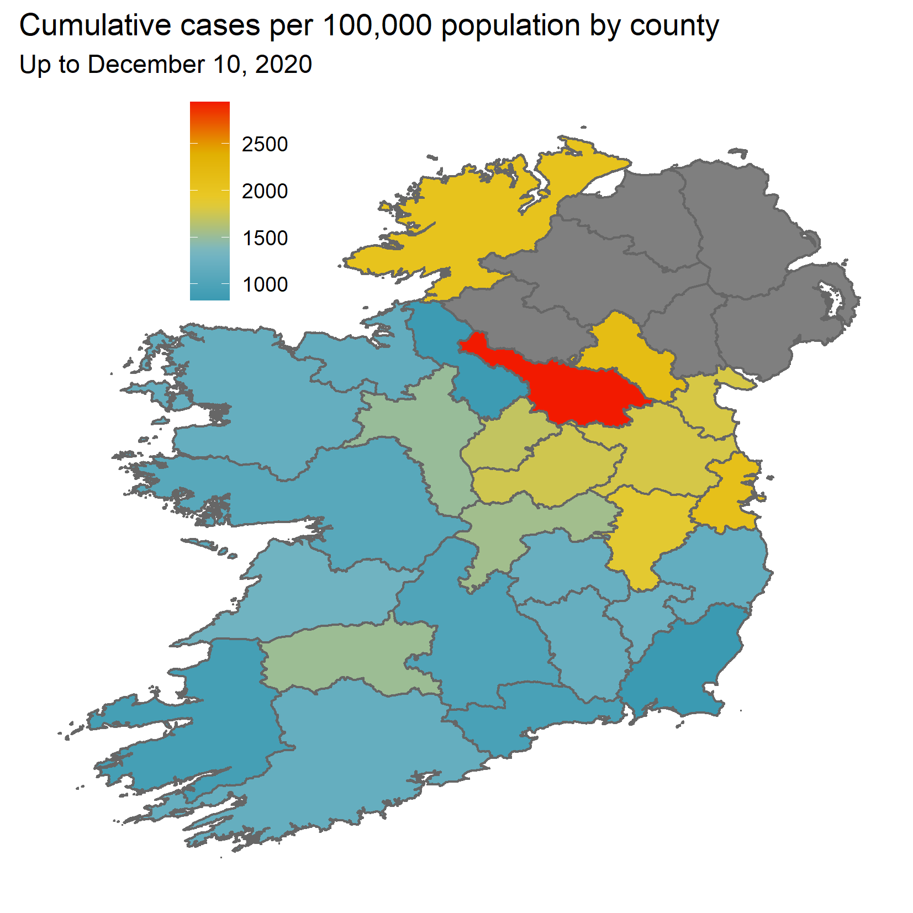
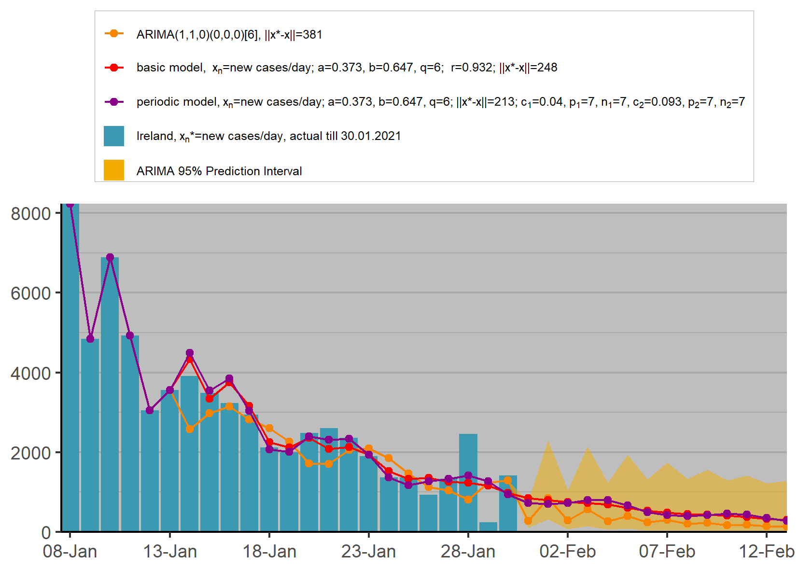
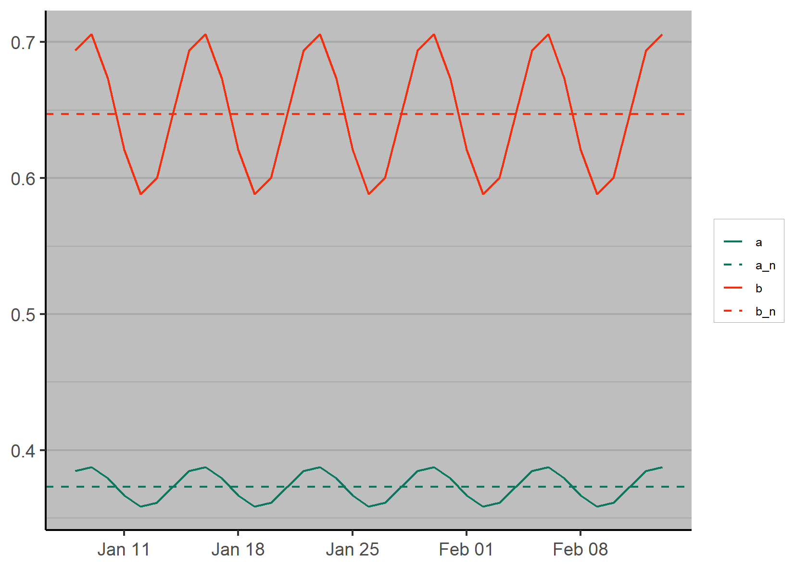
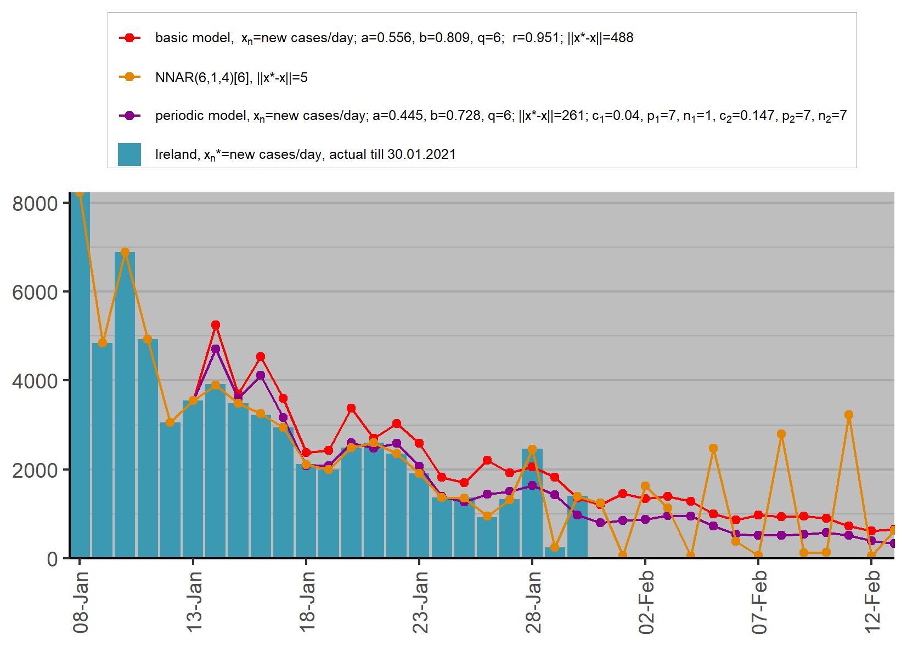

# TCD_FinalYearProject
 
 Code and plots (also displayed in an ``Rmd`` file) repository for my final year project at TCD.
 
 To-do List:
 
 - [x] Map cases by county (e.g. 14 day rate per 100,000) in Ireland. 
 - [ ] Train (two months) and test (latest week or 2 weeks) subsets for model to avoid overfitting.
 - [x] Summary code in body of the report and full code in appendix.
 - [ ] Theory for the multiphase model and neural networks.
 - [x] Group the plots so they take up a bit less space.
 - [ ] Summary table of the performances of all models.
 
.

.

.

.
